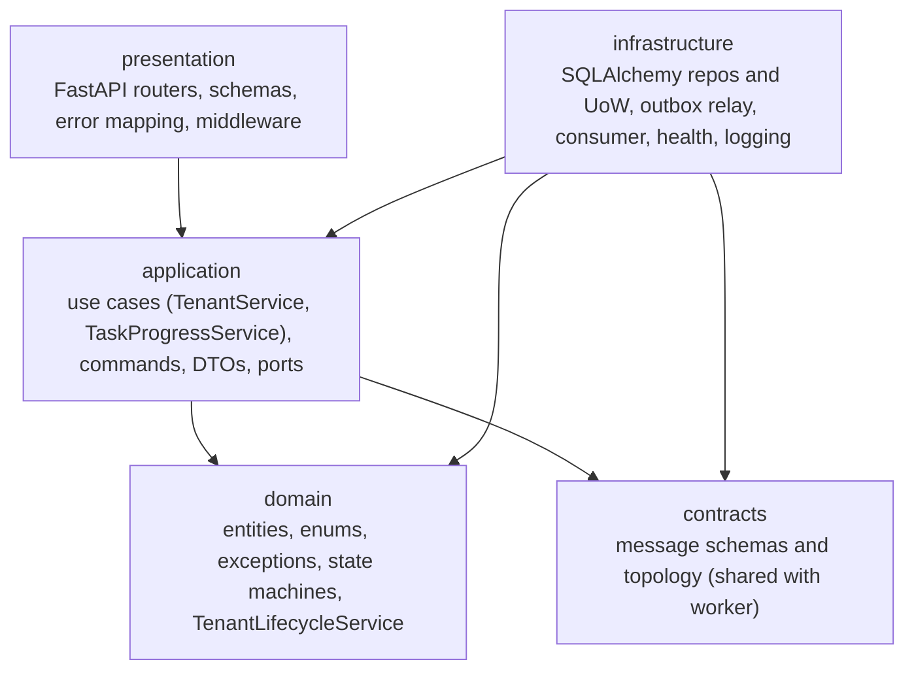
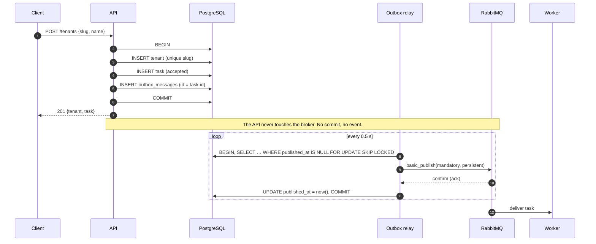
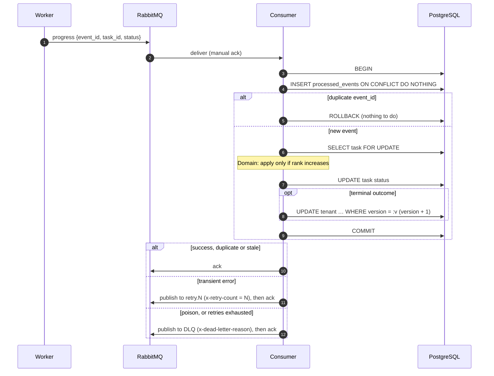

# Tenant Provisioning Control Plane

A control plane for a multi-tenant SaaS: it records tenants, turns every state-changing API
call into an asynchronous **task**, hands that task to provisioning workers over RabbitMQ, and
applies the workers' progress reports back to the task and the tenant. A worker simulator is
included, with switches that make failures, duplicates and out-of-order delivery easy to
reproduce.

**Stack:** Python 3.12, FastAPI, SQLAlchemy 2, PostgreSQL 16, Alembic, RabbitMQ 3.13 (pika),
Pydantic v2, pytest, ruff, mypy (strict), bandit, Docker Compose.

The only requirement is **Docker with Compose v2** (Docker Desktop on Windows/macOS). The
commands below are identical in Windows Command Prompt, PowerShell, macOS Terminal and Linux
shells; nothing needs to be installed locally (no Python, no `make`).

```bash
git clone <https://github.com/shashifromearth/multi-tenant-control-plane.git>
cd <multi-tenant-control-plane>

# boot everything (API, outbox relay, consumer, worker, PostgreSQL, RabbitMQ)
docker compose up --build

# full test suite with coverage (run in a second terminal)
docker compose --profile test run --rm --build tests make _test-in-container
```

`make up` / `make test` are shortcuts for the same commands if `make` is available
(usually on macOS and Linux; not on Windows by default). See the
[command reference](#11-command-reference-without-make) for every command.

---

## Contents

1. [Quick start](#1-quick-start)
2. [Architecture](#2-architecture)
3. [Design decisions and trade-offs](#3-design-decisions-and-trade-offs)
4. [API](#4-api)
5. [Messaging](#5-messaging)
6. [Concurrency](#6-concurrency)
7. [Failure scenarios and how to reproduce them](#7-failure-scenarios-and-how-to-reproduce-them)
8. [Testing and quality gates](#8-testing-and-quality-gates)
9. [Project layout](#9-project-layout)
10. [What I would do next](#10-what-i-would-do-next)
11. [Command reference (without make)](#11-command-reference-without-make)

More detail lives in [`docs/architecture.md`](docs/architecture.md) (sequence diagrams) and
[`docs/database.md`](docs/database.md) (ER diagram, indexes).

---

## 1. Quick start

**You need:** Docker with Compose v2. `make` is optional. Every target has a plain
`docker compose` equivalent that works the same on **Windows, macOS and Linux**; use the
right-hand column if `make` is not installed (the default on Windows).

| What | `make` | Plain command |
|---|---|---|
| Boot everything | `make up` | `docker compose up --build` |
| Full test suite (with coverage) | `make test` | `docker compose --profile test run --rm --build tests make _test-in-container` |
| Lint, format check, mypy, bandit | `make lint` | `docker compose --profile test run --rm --build tests make _lint-in-container` |
| All quality gates and tests (CI) | `make check` | `docker compose --profile test run --rm --build tests` |
| Live race demo against the stack | `make race-demo` | `docker compose up -d --build` then `docker compose --profile test run --rm --build tests python scripts/race_demo.py --base-url http://api:8000` |
| Broker fault scenarios | `make scenarios` | `docker compose up -d --build`, `docker compose stop worker`, then `docker compose --profile test run --rm --build tests python scripts/broker_scenarios.py --base-url http://api:8000`, then `docker compose start worker` |
| Stop / wipe volumes | `make down` / `make clean` | `docker compose down` / `docker compose --profile test down -v` |

Once it's running:

| Service | URL |
|---|---|
| API and Swagger UI | http://localhost:8000/docs |
| OpenAPI JSON | http://localhost:8000/openapi.json |
| Readiness / liveness | http://localhost:8000/health / http://localhost:8000/health/live |
| RabbitMQ management | http://localhost:15672 (user/password `controlplane` / `controlplane`, local only) |

To watch a tenant go through its whole lifecycle with no manual steps:

```bash
curl -s -XPOST localhost:8000/tenants -H 'content-type: application/json' \
     -d '{"slug":"acme","name":"ACME Corp"}'
# -> 201 {"tenant":{..."status":"provisioning","version":1}, "task":{..."type":"deploy","status":"accepted"}}

# a second or two later:
curl -s localhost:8000/tenants/<tenant-id>          # "status":"active", "version":2
curl -s "localhost:8000/tasks?tenant_id=<tenant-id>"  # deploy task: "status":"done"
```

> All ports are bound to `127.0.0.1`. The compose credentials are throw-away local defaults
> and can be overridden through env vars or `.env` (see `.env.example`). The repository
> contains no secrets.

---

## 2. Architecture

### 2.1 Runtime view

```mermaid
flowchart LR
    client([HTTP client])

    subgraph cp[Control plane: one image, three processes]
        api[api<br/>FastAPI]
        relay[outbox-relay]
        consumer[consumer]
    end

    subgraph pg[(PostgreSQL)]
        tenants[(tenants)]
        tasks[(tasks)]
        outbox[(outbox_messages)]
        inbox[(processed_events)]
    end

    subgraph mq[RabbitMQ]
        tx{{cp.tasks<br/>topic}}
        wq[[cp.worker.tasks]]
        px{{cp.task-progress<br/>topic}}
        pq[[cp.control-plane.task-progress]]
        rq[[...retry.1000/5000/30000ms]]
        dlq[[...dlq]]
    end

    worker[worker simulator]

    client -- REST --> api
    api -- "1 tx: tenant + task + outbox row" --> pg
    relay -- "poll committed rows<br/>FOR UPDATE SKIP LOCKED" --> outbox
    relay -- "publish + confirm" --> tx --> wq --> worker
    worker -- "in_progress / done / failed" --> px --> pq --> consumer
    consumer -- "1 tx: inbox + task + tenant" --> pg
    consumer -. transient error .-> rq -. TTL .-> pq
    consumer -. poison .-> dlq
```

| Process | Role | Scales |
|---|---|---|
| `api` | REST API. Writes the tenant, its task and an outbox row in **one transaction**. Never talks to the broker. | Horizontally (stateless) |
| `outbox-relay` | Publishes committed outbox rows with publisher confirms, then marks them published. | Horizontally (`SKIP LOCKED`) |
| `consumer` | Applies worker progress events: idempotent, order-tolerant, with retry/DLQ. | Horizontally (row lock + inbox PK) |
| `worker` | Simulates provisioning and reports progress. Fault-injection flags. | Horizontally |
| `migrate` | One-shot `alembic upgrade head`; everything else waits for it. | n/a |

All three control-plane roles ship in **one image** (`python -m control_plane api|relay|consumer`).
That keeps it a single deployable unit while still letting each role be health-checked,
restarted and scaled on its own.

### 2.2 Code layers (pragmatic Clean Architecture)



Dependencies point inward. The **domain** is plain Python: no I/O, no framework. The
**application** layer depends on `Protocol` *ports* (`UnitOfWork`, repositories), never on
SQLAlchemy. That is why the application services also have fast unit tests against
in-memory fakes. Wiring happens in exactly one place, `control_plane/container.py` (the
composition root), with no DI framework. FastAPI reaches it through small `Depends` providers.

| Pattern | Where | Why |
|---|---|---|
| Repository | `infrastructure/repositories/*` | Keeps SQL out of use cases; maps ORM rows to domain entities. |
| Unit of Work | `infrastructure/database/unit_of_work.py` | One use case = one transaction; nothing is committed unless `commit()` is called. |
| Domain service | `domain/services/tenant_lifecycle.py` | The rules that span tenant **and** task (guards, outcome → tenant status, order tolerance) live in one pure, unit-tested place. |
| Table-driven state machines | `domain/services/state_machine.py` | One transition table per entity. `status` is read-only on entities; `transition_to()` is the only way to change it, and it always validates. |
| Transactional outbox | `outbox_messages` + `infrastructure/outbox/relay.py` | Events are published only after the commit, and never for a rollback. |
| Idempotent consumer (inbox) | `processed_events` + `TaskProgressService` | At-least-once delivery becomes exactly-once *effects*. |
| Optimistic locking | `SqlTenantRepository.update` | Compare-and-swap on `version` in a single `UPDATE ... WHERE version = :expected`. |

Deliberately **not** used: CQRS, event sourcing, sagas, a DI container, or a generic
"base repository". None of them would earn their complexity at this size.

---

## 3. Design decisions and trade-offs

**State transitions cannot be bypassed.** `Tenant.status` and `Task.status` are read-only
properties. `transition_to()` always goes through `StateMachine.ensure()`, which raises
`InvalidStateTransition` for anything not in the table. API guards ("PATCH only from
`active`", "DELETE only from `active`/`failed`") reuse the same table
(`can_transition(current, target)`), so no status `if` statements are scattered across
controllers.

**The task is the event.** A task's outbox row has the same id as the task, and the message
body is the task itself (`id`, `type`, `tenant_id`, `status`, timestamps, plus a small
tenant reference). The AMQP `message_id` is the task id too.

**Outbox relay: polling, not LISTEN/NOTIFY or CDC.** It polls every 0.5 s (configurable) and
claims rows with `FOR UPDATE SKIP LOCKED`, so several relays can run without double-sending.
*Trade-off:* up to one poll interval of extra latency and a small amount of idle polling,
in exchange for no extra infrastructure (Debezium) and simple reasoning. Publishing happens
while the claiming transaction is still open. A crash between the broker confirm and the DB
commit therefore re-sends the batch: **at-least-once**, which the consumers are built for.

**Ordering.** RabbitMQ (and several relays) cannot guarantee global ordering, but it is
never needed. At most one task per tenant is ever open, which the tenant status guards
guarantee and a **partial unique index** (`uq_tasks_one_open_per_tenant`) enforces as a
backstop. So per-tenant events never race each other on the outbound side. On the inbound
side, ordering is handled semantically (next point), not by the transport.

**Order tolerance through a monotonic rank.** `accepted(0) < in_progress(1) < done|failed(2)`.
An update is applied only if it moves the task *strictly forward*. A duplicate, an
`in_progress` after `done`, or anything targeting a terminal task is a **no-op, not an
error**, so redelivery is always safe. If `done` overtakes `in_progress`, the task is walked
`accepted → in_progress → done`, so every hop is still validated by the state machine, and
the late `in_progress` then arrives as stale. Rank is used instead of the event `timestamp`
on purpose: worker clocks can't be trusted, while "status only moves forward" is a domain
fact.

**Idempotency is enforced atomically in the database.** `INSERT ... ON CONFLICT DO NOTHING`
on `processed_events.event_id`, in the **same transaction** as the state change. Two
consumers handling the same event at the same moment serialize on the primary key, and the
second becomes a no-op. If processing fails, the inbox row rolls back with everything else,
so a retry starts clean. The worker derives event ids deterministically
(`uuid5(task_id, status)`), so a redelivered task produces *the same* event ids and is
deduplicated exactly.

**Two locking styles, each where it fits.** Tenants use **optimistic** locking (`version`),
because clients send it on PATCH and it is part of the contract. Worker-applied changes go
through the same compare-and-swap, so they also bump `version`. Inside the consumer, the task
row is locked **pessimistically** (`SELECT ... FOR UPDATE`) for the few milliseconds of the
transaction, which serializes progress for one task across consumer replicas without retry
storms. If a worker update loses a tenant CAS (practically impossible, because no API
mutation is allowed while a task is open), the consumer retries it with backoff.

**Retries: tiered TTL queues, not one queue with per-message TTL.** A per-message TTL in a
single queue blocks at the head of the queue (an expired message waits behind a longer-lived
one). Each tier has a fixed TTL (`1s, 5s, 30s`) and dead-letters back into the main queue
through the default exchange, so only this consumer sees the retry. After the last tier, the
message goes to the DLQ with the reason in `x-dead-letter-reason`. **Poison messages**
(invalid JSON or schema, unknown task, impossible transition) skip the retries and go
straight to the DLQ, because retrying can't fix them.

**Error classification.** `TenantVersionConflict`, database errors and any unexpected
exception are treated as **transient** (retry). Other `DomainError`s are **permanent** (DLQ).
"Unknown is transient" is the safer default: the worst case is a few retries before the DLQ,
never a lost message.

**Soft lifecycle for tenants.** `DELETE` is asynchronous (`202`) and ends in `destroyed`; the
row is kept, so the slug stays reserved forever (as the spec requires) and the history stays
queryable.

**HTTP semantics.** `POST` returns `201` with `Location: /tenants/{id}` (the resource exists
right away and its status shows provisioning). `PATCH` and `DELETE` return `202` with
`Location: /tasks/{task_id}` (the operation is accepted and will finish asynchronously).
Mutating responses return `{tenant, task}`, so clients get the task id to poll without a
second call. Every tenant response carries an `ETag: "<version>"`. `DELETE` optionally
accepts `If-Match` for a conditional delete. `PATCH` takes the version in the body
(required), because the assignment defines `version` as a field.

**Pagination: limit/offset.** Easy to read and document, with a stable order
(`created_at DESC, id DESC`, backed by composite indexes). *Trade-off:* deep offsets get
slower and can shift under concurrent inserts. Keyset pagination would be the next step at
scale.

**Synchronous SQLAlchemy and pika.** FastAPI runs sync endpoints in its thread pool, which
keeps the transactional code simple and easy to walk through line by line. `async` would buy
throughput this workload doesn't need.

**IDs** are random UUIDv4 (no enumeration, no coordination). UUIDv7 would improve index
locality, but it's not in the 3.12 standard library, so it isn't worth a dependency here.

---

## 4. API

Interactive docs: **http://localhost:8000/docs**. Timestamps are ISO 8601 UTC with
milliseconds and a `Z` suffix (`2026-10-06T07:45:17.395Z`).

| Method | Path | Success | Notes |
|---|---|---|---|
| `POST` | `/tenants` | `201` | Body `{slug, name}`. Creates the tenant (`provisioning`) and a `deploy` task. |
| `GET` | `/tenants` | `200` | `?status=&slug=&limit=(1-100, default 20)&offset=` |
| `GET` | `/tenants/{id}` | `200` | `ETag: "<version>"` |
| `PATCH` | `/tenants/{id}` | `202` | Body `{version, name}`. Only from `active`. Creates an `update` task. |
| `DELETE` | `/tenants/{id}` | `202` | Only from `active` or `failed`. Creates a `destroy` task. Optional `If-Match`. |
| `GET` | `/tasks` | `200` | `?tenant_id=&status=&type=&limit=&offset=` |
| `GET` | `/tasks/{id}` | `200` | Tasks are read-only over HTTP. |
| `GET` | `/health` | `200`/`503` | Readiness: DB, broker, outbox backlog and age. |
| `GET` | `/health/live` | `200` | Liveness. |

List responses: `{"items": [...], "total": 42, "limit": 20, "offset": 0}`.

### Errors

Every error uses the same envelope, with no stack traces:

```json
{
  "error": {
    "code": "tenant_version_conflict",
    "message": "Version conflict for tenant '…': version 1 is no longer current",
    "details": {"tenant_id": "…", "expected_version": 1},
    "correlation_id": "4f0c…"
  }
}
```

| Code | HTTP | When |
|---|---|---|
| `validation_error` | 422 | Bad body, query or path (slug regex, empty name, unknown field, bad UUID, `limit` out of range). |
| `tenant_not_found` | 404 | No tenant with that id. |
| `task_not_found` | 404 | No task with that id. |
| `tenant_already_exists` | 409 | Slug taken, including by a `destroyed` tenant. |
| `tenant_update_not_allowed` | 409 | PATCH or DELETE not allowed in the current status. Applies to DELETE as well: the contract has one "mutation not allowed" code. |
| `tenant_version_conflict` | 409 | Stale `version` on PATCH, stale `If-Match` on DELETE, or a lost race. |
| `precondition_invalid` | 400 | Malformed `If-Match`. |
| `not_found` / `method_not_allowed` | 404 / 405 | Unknown route or method. |
| `internal_error` | 500 | Unexpected failure (details are logged, never returned). |

The mapping lives in one place: `presentation/api/errors.py`. Business code only raises
domain exceptions. Each exception carries its stable `code`, and HTTP statuses are chosen in
the presentation layer.

### Examples

```bash
# create
curl -i -XPOST localhost:8000/tenants -H 'content-type: application/json' \
     -H 'X-Correlation-ID: demo-123' -d '{"slug":"acme","name":"ACME"}'

# list / filter / paginate
curl -s 'localhost:8000/tenants?status=active&limit=10&offset=0'
curl -s 'localhost:8000/tasks?tenant_id=<id>&status=done&type=deploy'

# update (send the version you read; only from active)
curl -s -XPATCH localhost:8000/tenants/<id> -H 'content-type: application/json' \
     -d '{"version":2,"name":"ACME Inc"}'

# delete (optionally conditional)
curl -s -XDELETE localhost:8000/tenants/<id> -H 'If-Match: "4"'

# readiness
curl -s localhost:8000/health
# {"status":"ok","checks":{"database":{"ok":true,"outbox_pending":0,"outbox_oldest_pending_age_s":0.0,...},"broker":{"ok":true,...}}}
```

> On Windows PowerShell, use `curl.exe` (plain `curl` is an alias for `Invoke-WebRequest`) or
> the Swagger UI.

### Observability

* **Structured JSON logs** on stdout from every process (`ts`, `level`, `service`, `msg`,
  plus context fields such as `tenant_id`, `task_id`, `event_id`).
* **Correlation id**: send `X-Correlation-ID` or one is generated. It is returned in the
  response header and the error body, stored on the outbox row, sent as the AMQP
  `correlation_id`, copied by the worker onto its progress events, and restored by the
  consumer. So `docker compose logs | grep <id>` follows one operation across all four
  processes.
* **Readiness** (`/health`) reports DB and broker reachability with latency, plus **outbox
  backlog and age of the oldest unpublished row**. That is the key signal that the relay or
  the broker is stuck.
* **Container health checks**: the API checks `/health/live`; the relay and consumer touch a
  heartbeat file from their loops, and Docker marks them unhealthy if it goes stale.

---

## 5. Messaging

### Topology (prefix `cp`, configurable via `BROKER_PREFIX`)

| Name | Kind | Purpose |
|---|---|---|
| `cp.tasks` | topic exchange | Outbound tasks, routing key `task.<type>` |
| `cp.worker.tasks` | queue | Worker input; rejected (poison) tasks go to `cp.worker.tasks.dlq` |
| `cp.task-progress` | topic exchange | Inbound progress, routing key `task.progress.<status>` |
| `cp.control-plane.task-progress` | queue | Consumer input |
| `cp.control-plane.task-progress.retry.{1000,5000,30000}ms` | queues | Backoff tiers (TTL, then back to the input queue) |
| `cp.control-plane.task-progress.dlq` | queue | Parked messages, with `x-dead-letter-reason` |

Everything is durable, messages are persistent, publishers use **confirms**, and consumers
use **manual acks**. Topology is declared idempotently by every process from one shared
definition (`src/contracts/topology.py`), so queue arguments can't drift apart.

### Message schemas (`src/contracts/messages.py`)

Outbound, `TaskMessage` (AMQP `message_id` = task id, `type` = `task.created`):

```json
{
  "schema_version": 1,
  "id": "2ee7de2b-…", "type": "deploy", "tenant_id": "de4cb809-…", "status": "accepted",
  "created_at": "2026-10-06T07:45:17.395Z", "updated_at": "2026-10-06T07:45:17.395Z",
  "tenant": {"id": "de4cb809-…", "slug": "acme", "name": "ACME"}
}
```

Inbound, `TaskProgressEvent`:

```json
{
  "schema_version": 1,
  "event_id": "1b8e5309-…",
  "task_id": "2ee7de2b-…",
  "status": "in_progress | done | failed",
  "timestamp": "2026-10-06T07:45:18.180Z",
  "reason": "optional failure reason"
}
```

`event_id` is the idempotency key and `task_id` is the reference. Unknown fields are
ignored, so schemas can evolve forward, and `schema_version` allows breaking changes later.

### Outbound flow



### Inbound flow



---

## 6. Concurrency

| Race | Mechanism | Loser gets |
|---|---|---|
| Two creates with the same slug | Unique index `uq_tenants_slug`. No racy pre-check: the second `INSERT` blocks on the index until the first commits, then fails. The `IntegrityError` is translated by constraint name. | `409 tenant_already_exists` |
| Two PATCHes with the same `version` | `UPDATE tenants SET …, version = version + 1 WHERE id = :id AND version = :v RETURNING version`. Under READ COMMITTED, a blocked writer re-checks `WHERE` against the committed row and matches 0 rows. | `409 tenant_version_conflict` |
| PATCH and DELETE at the same time | Same compare-and-swap. The loser sees a stale version or the new status. | `409 tenant_version_conflict` / `tenant_update_not_allowed` |
| Same progress event delivered to two consumers | Inbox primary key + `ON CONFLICT DO NOTHING` in the same transaction | No-op (`duplicate`) |
| Conflicting outcomes for one task (`done` vs `failed`) | Task row lock + "terminal is final" | No-op (`stale`) |
| Two relays | `FOR UPDATE SKIP LOCKED` | Each takes a different row |

**Proof, in the test suite.** `tests/concurrency/test_races.py` releases 16 threads at once
through a `threading.Barrier` against real PostgreSQL. It asserts *exactly* one winner for
duplicate slugs, same-version PATCHes, PATCH vs DELETE, the same event delivered concurrently,
and conflicting outcomes. The asserts check outcomes, which are the same under any
interleaving, so the tests aren't flaky.

**Proof, against the running stack:**

With `make` (macOS / Linux):

```bash
make race-demo
```

Without `make` (Windows Command Prompt / PowerShell, macOS, Linux):

```bash
docker compose up -d --build
docker compose --profile test run --rm --build tests python scripts/race_demo.py --base-url http://api:8000
```

The API must be running first: the demo runs in the `tests` container and calls the
`api` service by name. If the stack is down, the script waits up to 90 s and then tells you
to start it. Expected output:

```text
[1] 20 concurrent POST /tenants slug=race-b67d069d
    {'409 tenant_already_exists': 19, '201 ok': 1}
[2] 20 concurrent PATCH /tenants/45fa… with version=2
    {'409 tenant_version_conflict': 19, '202 ok': 1}
RESULT: PASS - exactly one winner each time
```

---

## 7. Failure scenarios and how to reproduce them

### 7.1 Through the worker's settings (restart with different env vars)

Every CLI flag has an env-var twin. `docker compose up -d worker` recreates only the worker
with the new settings:

```bash
WORKER_FAIL_RATE=1 docker compose up -d worker            # every task fails -> tenant "failed"
WORKER_DUPLICATE_RATE=1 docker compose up -d worker       # every progress event published twice
WORKER_OUT_OF_ORDER_RATE=1 docker compose up -d worker    # terminal event published BEFORE in_progress
WORKER_MIN_DELAY_MS=5000 WORKER_MAX_DELAY_MS=15000 docker compose up -d worker   # slow provisioning
docker compose up -d worker                               # back to defaults
```

These use bash/zsh syntax (macOS/Linux). On Windows use `set WORKER_FAIL_RATE=1` (Command
Prompt) or `$env:WORKER_FAIL_RATE="1"` (PowerShell) before `docker compose up -d worker`; see
[§11](#11-command-reference-without-make).

or with CLI flags, as a one-off worker:

```bash
docker compose stop worker
docker compose run --rm worker worker --fail-rate=1 --min-delay-ms=100 --max-delay-ms=300
```

| Flag / env | Effect | What you observe |
|---|---|---|
| `--fail-rate` / `WORKER_FAIL_RATE` | Probability a task ends `failed` | Task `failed`, tenant `failed`; `DELETE` is still allowed from `failed`. |
| `--duplicate-rate` / `WORKER_DUPLICATE_RATE` | Each event sent twice (same `event_id`) | Consumer logs `duplicate progress event ignored`; `version` goes up once. |
| `--out-of-order-rate` / `WORKER_OUT_OF_ORDER_RATE` | `done`/`failed` sent before `in_progress` | Task fast-forwards to `done`; the late `in_progress` is logged `stale`. |
| `--min-delay-ms` / `--max-delay-ms` | Simulated work time | Tenant stays in `provisioning` longer. |
| `--seed` | Reproducible randomness | Same run every time. |

### 7.2 Publishing directly to the broker

**Automated** (stops the worker, runs the scenarios, checks results through the API, then
restarts the worker).

With `make` (macOS / Linux): `make scenarios`

Without `make` (Windows Command Prompt / PowerShell, macOS, Linux):

```bash
docker compose up -d --build
docker compose stop worker
docker compose --profile test run --rm --build tests python scripts/broker_scenarios.py --base-url http://api:8000
docker compose start worker
```

Expected output:

```text
#  1) out-of-order: 'done' arrives before 'in_progress'
#   [PASS] tenant active after done
#   [PASS] late in_progress ignored: task stays done
#   [PASS] tenant version unchanged by stale event
#  2) duplicate delivery of the same event_id
#   [PASS] tenant failed exactly once (version bumped once)
#  3) poison messages: not JSON / unknown task -> DLQ, consumer keeps running
#   [PASS] DLQ holds poison messages (depth=2)
#   [PASS] API + consumer still healthy (DELETE from failed accepted)
```

**By hand, with only RabbitMQ's own HTTP API** (`scripts/publish-progress.sh` wraps
`curl` against the management API; needs bash and curl, e.g. Git Bash on Windows):

```bash
docker compose stop worker                                    # so you control the events
TENANT=$(curl -s -XPOST localhost:8000/tenants -H 'content-type: application/json' \
         -d '{"slug":"manual-1","name":"Manual"}')
TASK=$(echo "$TENANT" | python3 -c 'import sys,json;print(json.load(sys.stdin)["task"]["id"])')

./scripts/publish-progress.sh "$TASK" done                      # out of order: done first
./scripts/publish-progress.sh "$TASK" in_progress               # stale -> ignored
./scripts/publish-progress.sh "$TASK" done 11111111-1111-1111-1111-111111111111
./scripts/publish-progress.sh "$TASK" done 11111111-1111-1111-1111-111111111111   # duplicate
./scripts/publish-progress.sh --raw 'not json at all'           # poison -> DLQ
curl -s "localhost:8000/tasks/$TASK"                           # status stays "done"
docker compose start worker
```

The raw `curl` it runs is:

```bash
curl -u controlplane:controlplane -XPOST \
  http://localhost:15672/api/exchanges/%2F/cp.task-progress/publish \
  -H 'content-type: application/json' \
  -d '{"properties":{},"routing_key":"task.progress.done","payload_encoding":"string",
       "payload":"{\"event_id\":\"<uuid>\",\"task_id\":\"<task>\",\"status\":\"done\",\"timestamp\":\"2026-10-06T10:00:00Z\"}"}'
```

Inspect the DLQ (including the `x-dead-letter-reason` header) in the management UI under
*Queues → cp.control-plane.task-progress.dlq → Get messages*.

### 7.3 Infrastructure failures

| Failure | Behaviour | Try it |
|---|---|---|
| Broker down while the API takes writes | API keeps accepting (only needs the DB); outbox rows accumulate; `/health` reports `503` with growing `outbox_oldest_pending_age_s`; relay reconnects with jittered exponential backoff and drains the backlog. | `docker compose stop rabbitmq`, create tenants, `docker compose start rabbitmq` |
| Relay crashes after publish, before commit | Row is re-published on restart (at-least-once); the worker and consumer deduplicate. | Covered by design and tests |
| DB down while the consumer runs | Handler classifies it as transient: retry tiers 1 s → 5 s → 30 s, then DLQ. Unacked messages are redelivered if the consumer itself dies. | `docker compose stop postgres` for a few seconds |
| Consumer crash mid-message | No ack, so the broker redelivers; the transaction never committed, so it is processed cleanly. | `docker compose kill consumer && docker compose start consumer` |
| Worker crash mid-task | Task message unacked and redelivered; the worker re-emits **the same** deterministic event ids. | `docker compose kill worker && docker compose start worker` |
| Poison message | DLQ with a reason; consumer keeps going. | §7.2 |
| Restart everything | PostgreSQL and RabbitMQ use named volumes; tenants, tasks and queued messages survive. | `docker compose restart` |

---

## 8. Testing and quality gates

| What | With `make` (macOS / Linux) | Without `make` (Windows, macOS, Linux) |
|---|---|---|
| Tests + coverage (fails under 80%) | `make test` | `docker compose --profile test run --rm --build tests make _test-in-container` |
| ruff format check, ruff lint, mypy --strict, bandit | `make lint` | `docker compose --profile test run --rm --build tests make _lint-in-container` |
| Everything above (what CI runs) | `make check` | `docker compose --profile test run --rm --build tests` |

These run `make` *inside* the test container, so they work without `make` on your machine.
The test container starts PostgreSQL and RabbitMQ itself; the rest of the stack does not
need to be running.

Everything runs **inside Docker** against the compose PostgreSQL and RabbitMQ. The tests
create a throw-away database migrated **with Alembic** (so migrations are tested too) and an
isolated broker prefix, so they never touch the running stack's data. In the container,
missing services fail the run instead of being skipped.

Current result: **216 tests, ~98% line+branch coverage, about 15 s.**

| Suite | Covers |
|---|---|
| `tests/unit` | Every `(from, to)` pair of both state machines; entity invariants and slug/name validation; lifecycle rules (guards, outcome mapping, fast-forward, stale and terminal no-ops); application services against **in-memory fakes** (including optimistic locking); consumer ack/retry/DLQ classification and retry-tier escalation; worker plans (fail, duplicate, reorder, deterministic ids); schemas, timestamp format, `If-Match` parsing; JSON logging and correlation ids. |
| `tests/integration` | Every endpoint, status code and error code; pagination and filters; ETag/Location headers; a crash mid-use-case leaves **no** tenant, task or outbox row; deterministic two-writer compare-and-swap; DB-level invariants (one open task, status checks); **Alembic migration == ORM models** (autogenerate diff is empty). |
| `tests/messaging` | Outbox: committed → published with the task as the event; **uncommitted / rolled back → never published**; unroutable stays pending with an error. Consumer via the real broker: duplicates, out-of-order, poison → DLQ, transient → retried through the TTL queues, exhausted → DLQ, broker outage survival. **End to end** (API → relay → RabbitMQ → real worker → consumer): full deploy → update → destroy lifecycle; `fail_rate=1`; `duplicate_rate=1` combined with `out_of_order_rate=1` still ends with exactly one effective change per task. |
| `tests/concurrency` | 16-thread barrier races (see [§6](#6-concurrency)). |

---

## 9. Project layout

```
src/
  contracts/                  # wire contract shared by control plane and worker
    messages.py               #   TaskMessage, TaskProgressEvent
    topology.py               #   exchanges/queues/retry tiers + idempotent declare()
  control_plane/
    domain/
      entities/               #   Tenant, Task (read-only status, transition_to)
      enums/                  #   TenantStatus, TaskStatus, TaskType
      exceptions/             #   business errors with stable codes
      services/
        state_machine.py      #   transition tables (single source of truth)
        tenant_lifecycle.py   #   guards, outcome -> tenant status, order tolerance
      validation.py, clock.py
    application/
      commands/  dto/         #   intent objects, Page/filters/OutboxMessage
      ports.py                #   UnitOfWork + repository Protocols
      services/               #   TenantService, TaskService, TaskProgressService, events
    infrastructure/
      database/               #   ORM models, engine/session, SqlAlchemyUnitOfWork
      repositories/           #   tenant (CAS update), task, outbox, processed_events
      outbox/relay.py         #   transactional outbox relay
      consumers/              #   progress consumer (retry tiers, DLQ)
      messaging/connection.py #   connect, backoff, heartbeat
      health.py, logging.py
    presentation/
      api/                    #   app factory, routers, errors, middleware, deps, health
      schemas/                #   request/response models
    container.py              # composition root
    config.py                 # env-based settings
    correlation.py            # correlation-id context
    __main__.py               # python -m control_plane api|relay|consumer
  worker/                     # simulator (+ CLI in __main__.py)
alembic/                      # migrations (0001_initial_schema)
tests/  unit/ integration/ messaging/ concurrency/
scripts/  race_demo.py  broker_scenarios.py  publish-progress.sh
docs/     architecture.md  database.md
```

### Configuration (env vars)

| Variable | Default (compose) | Used by |
|---|---|---|
| `DATABASE_URL` | `postgresql+psycopg://controlplane:…@postgres:5432/controlplane` | control plane |
| `AMQP_URL` | `amqp://controlplane:…@rabbitmq:5672/%2F` | all |
| `BROKER_PREFIX` | `cp` | all |
| `LOG_LEVEL` | `INFO` | all |
| `OUTBOX_POLL_INTERVAL_S` / `OUTBOX_BATCH_SIZE` | `0.5` / `50` | relay |
| `CONSUMER_PREFETCH` | `20` | consumer |
| `CONSUMER_RETRY_DELAYS_MS` | `[1000,5000,30000]` (JSON list) | consumer |
| `WORKER_FAIL_RATE`, `WORKER_MIN_DELAY_MS`, `WORKER_MAX_DELAY_MS`, `WORKER_DUPLICATE_RATE`, `WORKER_OUT_OF_ORDER_RATE` | `0`, `500`, `2000`, `0`, `0` | worker |

---

## 10. What I would do next

These are out of scope for the exercise, roughly in priority order:

* **Retention** for `processed_events` and published `outbox_messages` (a time-partitioned
  table or a periodic purge older than the maximum redelivery window).
* **Metrics** (Prometheus): outbox lag, consumer outcomes (applied / stale / duplicate /
  retry / DLQ), and request latency. OpenTelemetry tracing, reusing the correlation id.
* **DLQ tooling**: inspect and replay parked messages.
* **Quorum queues** and publisher-side flow control for production-grade RabbitMQ durability.
* **Task timeouts**: a sweeper that fails tasks stuck in `accepted`/`in_progress` beyond an
  SLA, so tenants can't sit in `provisioning` forever if a worker loses a task.
* **AuthN/AuthZ** and rate limiting on the API; keyset pagination; `If-Match` on PATCH as
  an alternative to the body `version`.

---

## 11. Command reference (without make)

All commands are run from the repository root and behave the same on **Windows (Command
Prompt or PowerShell), macOS and Linux**. They need Docker with Compose v2 only.

```bash
# --- run the stack
docker compose up --build                 # foreground, Ctrl+C to stop
docker compose up -d --build              # background
docker compose ps                         # status (migrate shows "exited (0)": expected)
docker compose logs -f api consumer worker
docker compose down                       # stop (data kept)
docker compose --profile test down -v     # stop and delete all data

# --- tests and quality gates (stack does not need to be running)
docker compose --profile test run --rm --build tests make _test-in-container   # tests + coverage
docker compose --profile test run --rm --build tests make _lint-in-container   # lint/format/types/security
docker compose --profile test run --rm --build tests                           # everything (CI)

# --- race-condition demo (stack must be running)
docker compose up -d --build
docker compose --profile test run --rm --build tests python scripts/race_demo.py --base-url http://api:8000

# --- broker fault scenarios (stack must be running)
docker compose up -d --build
docker compose stop worker
docker compose --profile test run --rm --build tests python scripts/broker_scenarios.py --base-url http://api:8000
docker compose start worker
```

Setting worker fault-injection variables differs by shell:

| Shell | Example |
|---|---|
| macOS / Linux (bash, zsh) | `WORKER_FAIL_RATE=1 docker compose up -d worker` |
| Windows Command Prompt | `set WORKER_FAIL_RATE=1` then `docker compose up -d worker` |
| Windows PowerShell | `$env:WORKER_FAIL_RATE="1"; docker compose up -d worker` |

Reset with `unset WORKER_FAIL_RATE` (bash/zsh), `set WORKER_FAIL_RATE=` (cmd) or
`Remove-Item Env:WORKER_FAIL_RATE` (PowerShell), then `docker compose up -d worker` again.
`scripts/publish-progress.sh` needs bash and curl (built in on macOS/Linux; Git Bash on
Windows).
