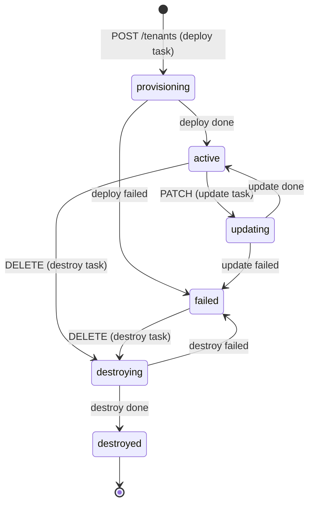
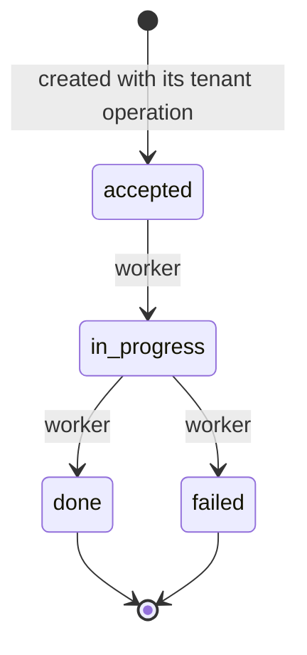
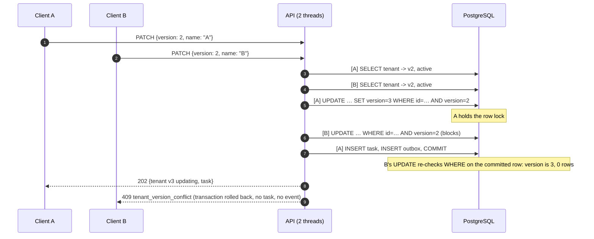
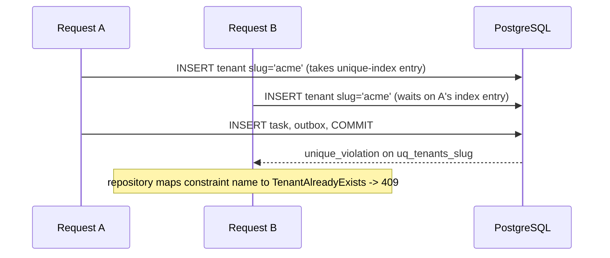
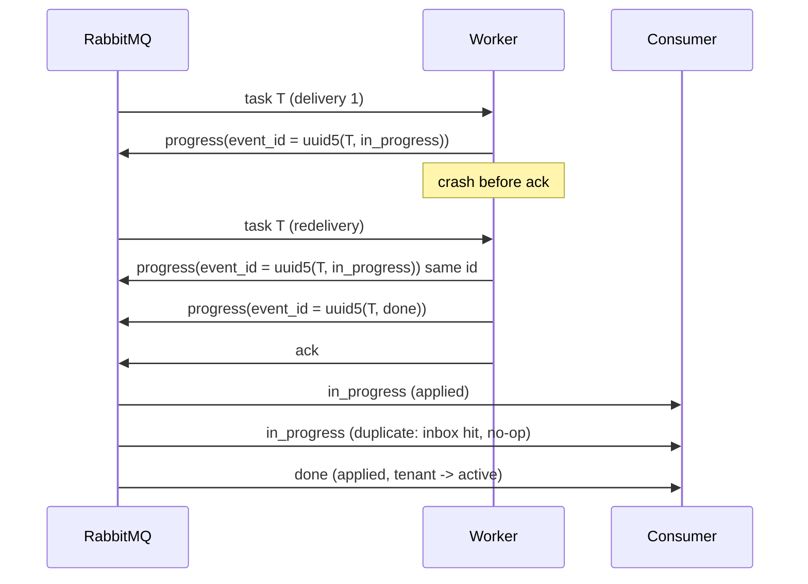

# Architecture notes

The README covers the overview, the patterns and the main trade-offs. This document adds
the remaining sequence diagrams and the reasoning behind the race-safety arguments.

## Tenant lifecycle

Both are encoded as transition tables in
`src/control_plane/domain/services/state_machine.py`, and an exhaustive parametrized test
checks every `(from, to)` pair of both against the specification.

## PATCH with optimistic locking: the race

The early `tenant.version != expected` check in `TenantService.update` only makes the common
"stale client" case fail fast. Correctness comes from the single-statement compare-and-swap.

## Duplicate slug: the race

There is no `SELECT … WHERE slug = ?` pre-check, because it could never be race-free. The
unique index is the single source of truth.

## Worker redelivery

Even if the redelivered run picks a *different* random outcome (for example `failed` after a
`done`), the first terminal outcome wins: terminal task states are immutable, and later
reports are recorded as `stale`.

## Why each process loop is safe to kill at any instruction

| Process | Kill point | Result |
|---|---|---|
| API | Anywhere before `COMMIT` | Transaction rolled back; no outbox row means no event. |
| API | After `COMMIT`, before the response | Tenant exists; a client retry gets `tenant_already_exists`, or `version_conflict` for PATCH. Visible via GET. |
| Relay | After publish, before `COMMIT` | Row still pending and re-published (duplicate); the worker's deterministic ids keep the effects single. |
| Consumer | Before `COMMIT` | Message unacked, so redelivered; the inbox row was rolled back, so it is processed fresh. |
| Consumer | After `COMMIT`, before ack | Redelivered; the inbox hit makes it a no-op. |
| Consumer | After retry/DLQ publish, before ack | Message both requeued and redelivered; the inbox makes the second processing a no-op. |
| Worker | Before final ack | Task redelivered; the same event ids are re-emitted. |
