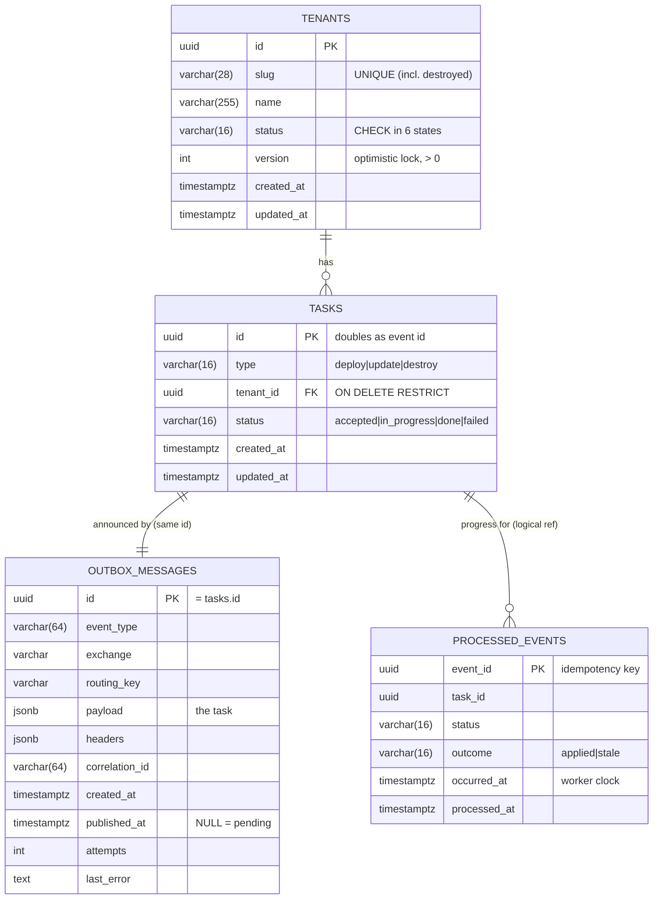

# Database design

PostgreSQL 16. The schema is managed by Alembic (`alembic/versions/0001_initial_schema.py`).
A test (`tests/integration/test_transactions.py::test_migrations_match_models`) checks that
the migration and the ORM models describe exactly the same schema.

## ER diagram

`processed_events.task_id` deliberately has **no** foreign key. An event for an unknown task
has to reach the service and be classified as poison (sent to the DLQ). It must not fail
earlier on a constraint, before we can tell what kind of message it is.

## Indexes and constraints

| Name | Definition | Serves |
|---|---|---|
| `uq_tenants_slug` | `UNIQUE (slug)` | Slug uniqueness, **the** arbiter of concurrent creates; also `?slug=` lookups |
| `ix_tenants_status` | `(status)` | `GET /tenants?status=` |
| `ix_tenants_created_at_id` | `(created_at, id)` | Stable newest-first pagination |
| `ix_tasks_tenant_id_created_at` | `(tenant_id, created_at)` | `GET /tasks?tenant_id=` (most common task query) and the FK |
| `ix_tasks_status` | `(status)` | `GET /tasks?status=` |
| `ix_tasks_created_at_id` | `(created_at, id)` | Pagination |
| `uq_tasks_one_open_per_tenant` | `UNIQUE (tenant_id) WHERE status IN ('accepted','in_progress')` | Backstop for the "at most one open task per tenant" invariant |
| `ix_outbox_messages_unpublished` | `(created_at) WHERE published_at IS NULL` | Relay polling; tiny because published rows drop out |
| `ix_processed_events_task_id` | `(task_id)` | Auditing a task's event history |
| `ck_*_status_valid`, `ck_tasks_type_valid`, `ck_tenants_version_positive` | `CHECK` | The database rejects impossible values even if application code has a bug |

Statuses are `VARCHAR` + `CHECK` rather than native `ENUM` types: adding a state later is a
one-line constraint change instead of an `ALTER TYPE` (which can't run inside a transaction
on older PostgreSQL versions).

## Transactions

* Isolation level **READ COMMITTED** (the PostgreSQL default), set explicitly on the engine.
  This is what makes the compare-and-swap correct: a concurrent `UPDATE … WHERE version = :v`
  that blocked on the row lock re-evaluates its `WHERE` against the newly committed row and
  matches nothing.
* Sessions are pinned to `timezone=UTC`. All timestamps are `timestamptz`, truncated to
  milliseconds in the domain, so stored and rendered values always agree.
